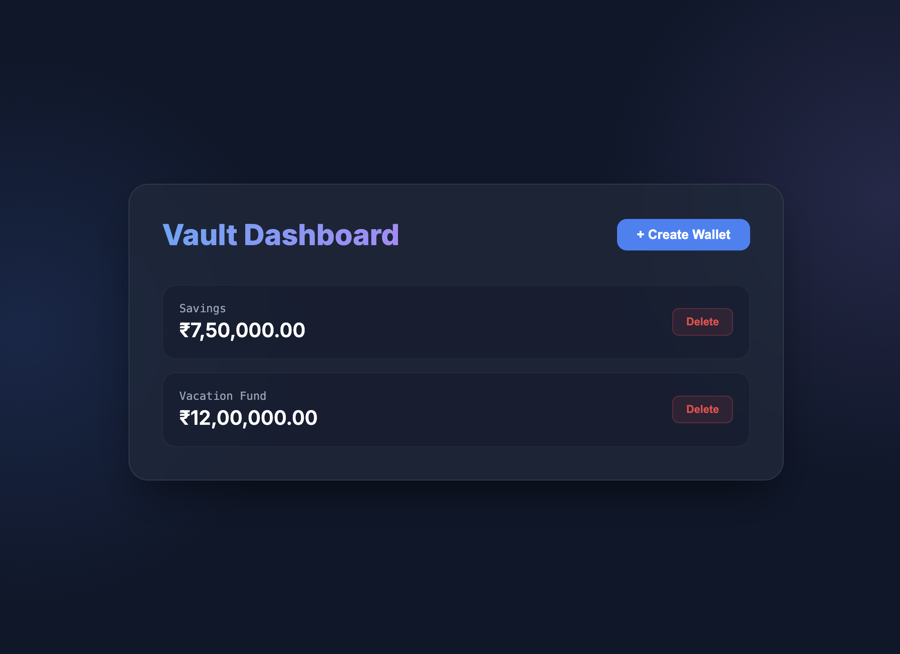

# Pocket Feel - Your Personal Digital Wallet
Pocket Feel is a modern, high-integrity full-stack digital wallet application. It provides a secure and intuitive interface for managing multiple wallets, tracking balances, and categorizing transactions.



## 🚀 Key Functionalities

### 1. Multi-Wallet Management
- **Create Wallets:** Setup multiple distinct vaults (e.g., "Savings", "Daily Expenses", "Travel Fund").
- **Initial Deposits:** Start any vault with an initial balance.
- **Dynamic List:** Real-time view of all your vaults and their current totals.
- **Secure Deletion:** Remove vaults that are no longer needed.

### 2. Transaction Integrity
- **Credit (Deposit):** Add funds to any wallet instantly.
- **Debit (Withdrawal):** Securely withdraw funds with automatic balance validation to prevent overdrafts.
- **ACID Compliance:** The backend ensures that balance updates and transaction logging happen atomically using TypeORM transactions.

### 3. Categorization & Tracking
- **Smart Categories:** Assign categories like *Groceries*, *Bills*, *Dining*, *Salary*, and more to your transactions.
- **Visual Icons:** Transaction history displays intuitive emojis for quick visual identification.
- **Detailed History:** View a complete ledger of every credit and debit ever made.
- **Pagination:** Clean, paginated history view (4 transactions per page) for efficient browsing.

---

## 🎨 Frontend Flow & User Session

Pocket Feel implements a streamlined "User ID Session" as per the assignment requirements, avoiding complex password-based authentication while ensuring data persistence.

1.  **Entry:** Upon first visit, the user is redirected to the `/login` page.
2.  **Session Initiation:** Users enter a simple **User ID** (e.g., "john"). This ID is stored in a secure `HttpOnly` cookie and `localStorage`.
3.  **Persistence:** The application uses this ID to scope all wallet operations. The session is preserved across page refreshes and browser restarts until the user explicitly logs out.
4.  **Data Isolation:** The backend uses the `userId` to ensure users only see and manage their own vaults.
5.  **Logout:** Signing out clears the stored session tokens and redirects the user back to the login screen.

---

## 🛠 Tech Stack

- **Frontend:** Next.js 15, React 19, Styled Components, TanStack Query.
- **Backend:** NestJS, TypeORM, class-validator.
- **Database:** PostgreSQL (Primary) / SQLite (Development Toggle).
- **Infrastructure:** Docker Compose for containerized PostgreSQL orchestration.

---

## 🚦 Getting Started & Environment Setup

### 1. Environment Variables (`.env`)

#### Backend (`backend/.env`)
Create a `.env` file in the `backend/` directory with the following:
```env
PORT=3001
DB_TYPE=postgres
DB_HOST=localhost
DB_PORT=5432
DB_USERNAME=postgres
DB_PASSWORD=postgres
DB_NAME=hscore_wallet
```

#### Frontend (`frontend/.env.local`)
Create a `.env.local` file in the `frontend/` directory:
```env
NEXT_PUBLIC_API_URL=http://localhost:3001/api/v1/wallet
```

### 2. Database Setup (PostgreSQL)
The project defaults to PostgreSQL. The recommended way to run it is via **Docker**:
```bash
docker compose up -d
```
*Alternatively, you can use local PostgreSQL via Homebrew (`brew services start postgresql@15`).*

### 3. Run Backend
```bash
cd backend
npm install
npm run start:dev
```

### 4. Run Frontend
```bash
cd frontend
npm install
npm run dev
```

---

## 🔄 Database Toggle & Migrations

### Local SQLite Development
If you prefer not to use PostgreSQL/Docker, you can switch to **SQLite** instantly:
```bash
cd backend && DB_TYPE=sqlite npm run start:dev
```
This will create a local `database.sqlite` file.

### Schema Synchronization
The application uses TypeORM's `synchronize: true` in development mode to automatically handle schema updates and migrations based on the TypeScript entities. For production, this is disabled to ensure data safety.

---

## 🌐 Production & Live Hosting
When deploying this project to the internet (e.g., Vercel, Render, Railway), configure the following environment variables in your hosting provider:

| Variable | Description | Example |
| :--- | :--- | :--- |
| `DB_TYPE` | Database Type | `postgres` |
| `DB_HOST` | Database Hostname | `your-db-instance.amazonaws.com` |
| `DB_PORT` | Database Port | `5432` |
| `DB_USERNAME` | Database User | `admin` |
| `DB_PASSWORD` | Database Password | `your-secure-password` |
| `DB_NAME` | Database Name | `wallet_prod` |
| `NODE_ENV` | Environment Mode | `production` |

*Note: In production mode, `synchronize` is automatically disabled to protect your data schema.*

---

## 📘 API Reference (v1)

Pocket Feel provides a comprehensive RESTful API for managing wallets and transactions.

**[See Detailed API Documentation (API.md)](./API.md)**

| Endpoint | Method | Parameters | Description |
| :--- | :--- | :--- | :--- |
| `/api/v1/wallet` | `GET` | `?userId={id}` | Fetch all wallets for a user |
| `/api/v1/wallet` | `POST` | `userId`, `name`, `initialBalance` | Create a new wallet |
| `/api/v1/wallet/:id` | `GET` | — | Get current balance |
| `/api/v1/wallet/:id/credit` | `POST` | `amount`, `category`, `description` | Deposit funds |
| `/api/v1/wallet/:id/debit` | `POST` | `amount`, `category`, `description` | Withdraw funds |
| `/api/v1/wallet/:id/history` | `GET` | `?limit=10&offset=0` | Fetch paginated ledger |
| `/api/v1/wallet/transactions/all` | `GET` | `?userId={id}` | Global activity feed |

---

*Developed by John Loui for HScore Wallet Assignment.*
