# 💳 Pocket Feel — High-Integrity Digital Wallet

Pocket Feel is a premium, full-stack digital wallet application designed for secure, user-scoped transaction management. Built with a "Mobile-First" philosophy, it offers a high-fidelity experience across all devices, ensuring ACID-compliant operations and intuitive financial tracking.

---

## 🌟 Core Product Value

### 🔐 Zero-Trust User Sessions
- **Passwordless Entry:** Instant access via a simple User ID (e.g., `Ronaldo`).
- **Secure Persistence:** Session integrity is maintained using `HttpOnly` secure cookies and `localStorage`, providing isolated data environments for every user.
- **Data Scoping:** All API requests are strictly scoped to the User ID, preventing unauthorized cross-account data exposure.

### 🛡️ Transactional Integrity
- **ACID Operations:** Leveraging TypeORM transactions, every credit and debit operation is atomic. Balance updates and ledger entries succeed or fail together—never leaving your wallet in an inconsistent state.
- **Overdraft Protection:** Robust backend validation ensures users cannot withdraw more than their available balance.
- **Safe Wallet Deletion:** Features a custom **"Safe Swipe Slider"** confirmation to prevent accidental loss of wallet data.

### 📊 Advanced Financial Audit
- **Infinite Ledger:** Deep audit trail with paginated transaction history.
- **Smart Categorization:** Automatically tag and organize expenses into categories like *Dining*, *Salary*, and *Utilities*.
- **Real-Time Sync:** Powered by **TanStack Query** for instant UI updates without disruptive page reloads.

---

## 📸 Full Product Showcase

### 📱 Mobile Experience
*Thumb-friendly navigation with native-feeling interactions.*

| Login Screen | Home & Portfolio | Wallet Management |
| :---: | :---: | :---: |
| 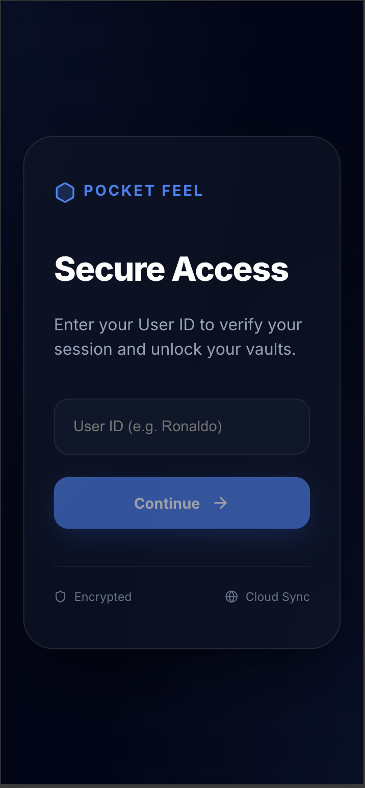 | 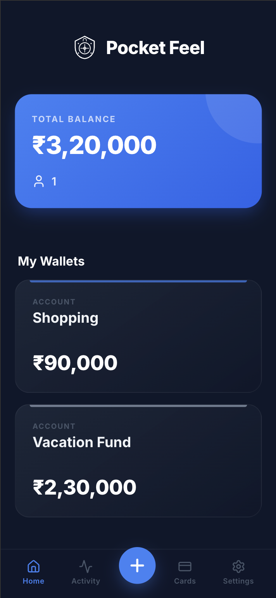 | 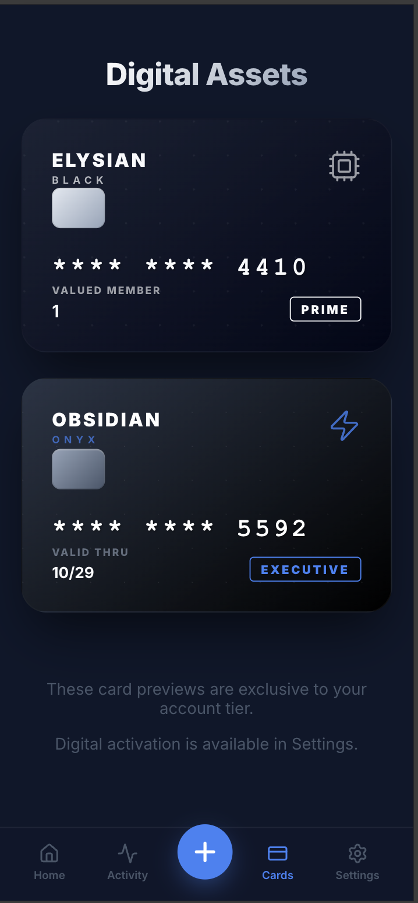 |
| **Activity Log** | **Safe Deletion** | **User Settings** |
| 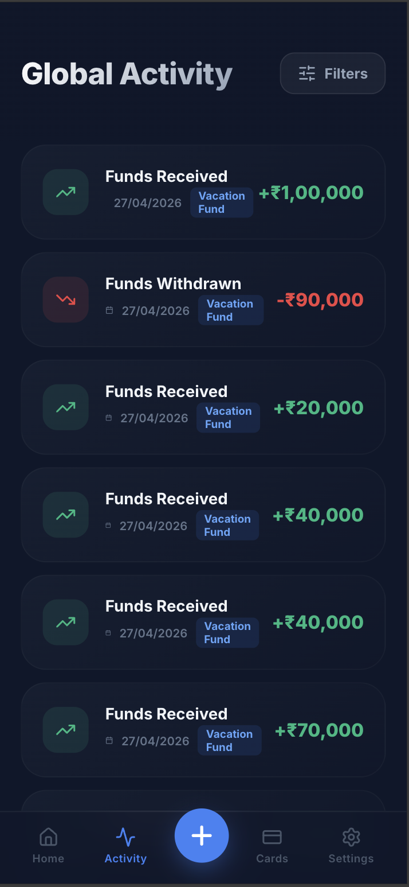 | 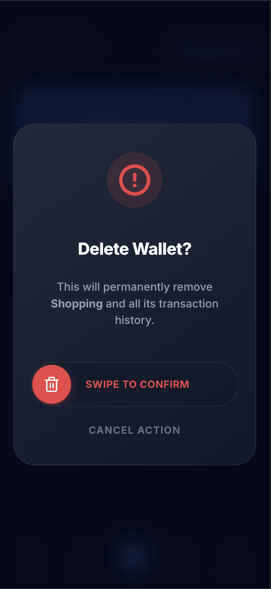 | 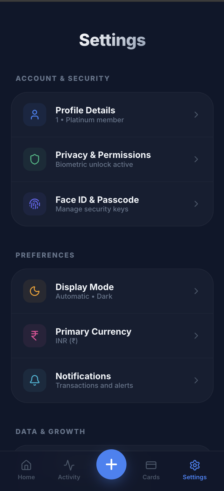 |
| **Settings (Cont.)** | | |
| 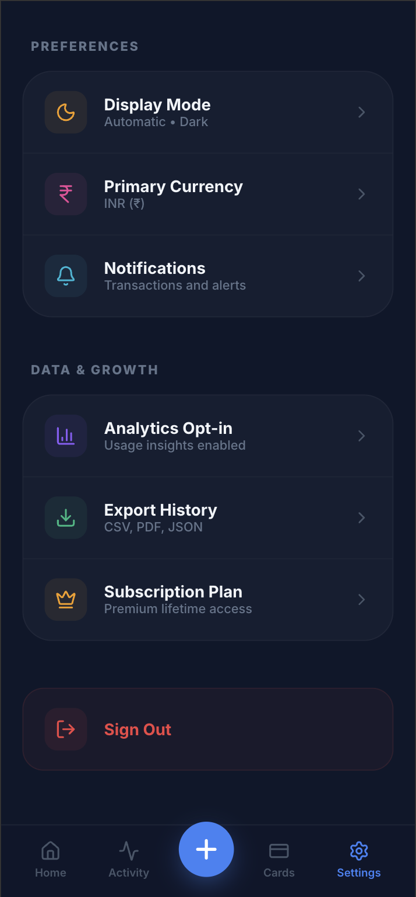 | | |

---

### 🖥️ Desktop Experience
*High-fidelity workspace designed for professional asset management.*

#### **1. Authentication & Portfolio**
**Login & Secure Entry**
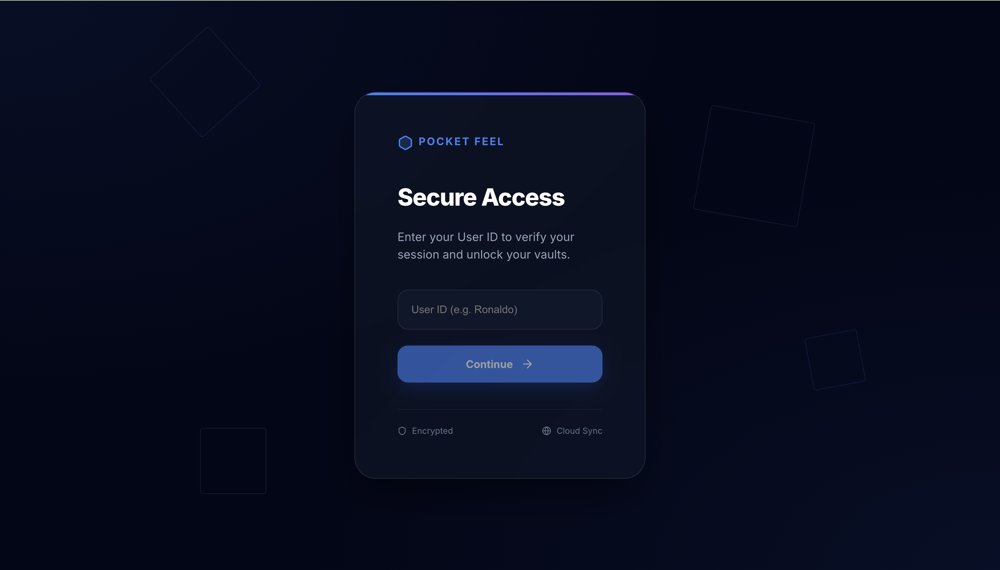

**Empty State Dashboard**
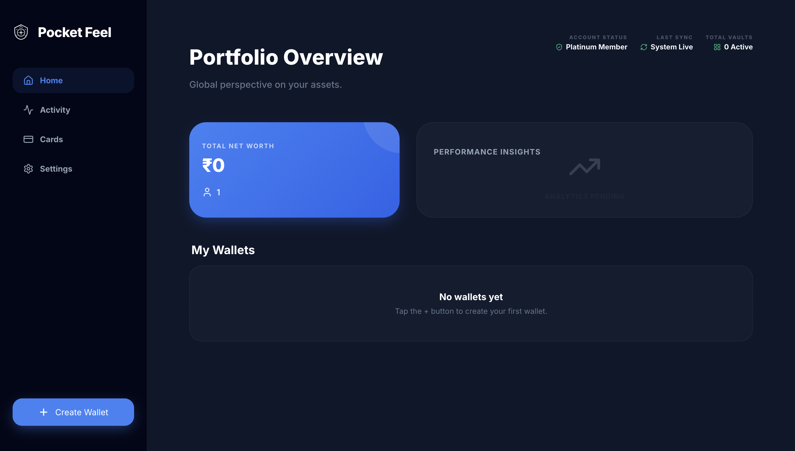

#### **2. Wallet Management**
**High-Fidelity Create Flow**
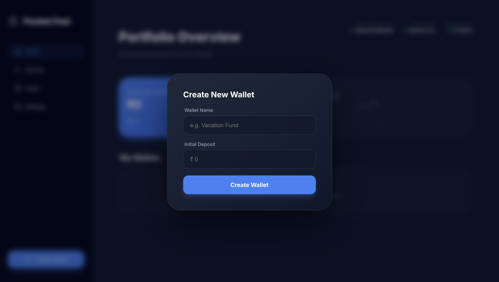

**Active Portfolio Dashboard**
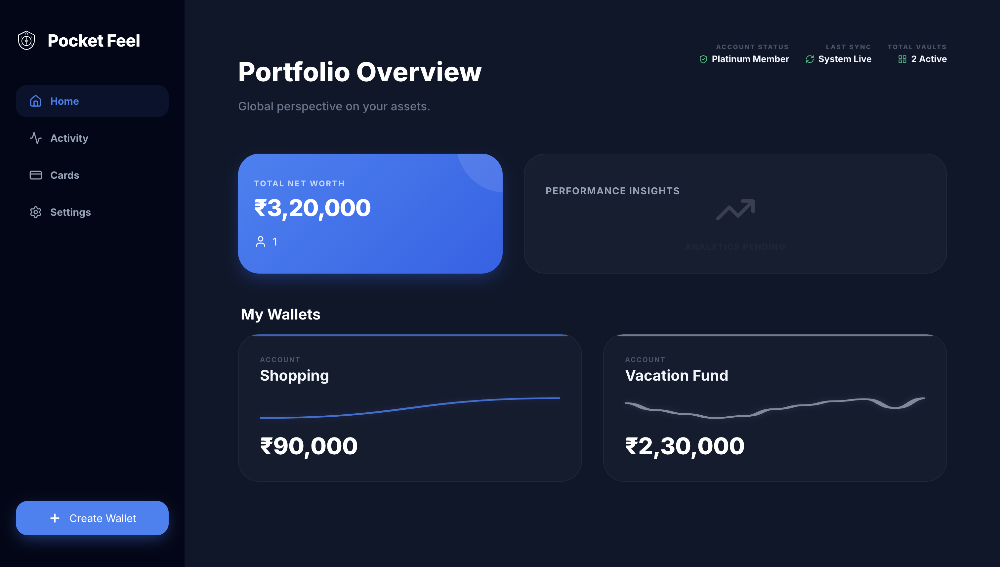

#### **3. Transaction Workspace**
**Real-Time Wallet Detail**
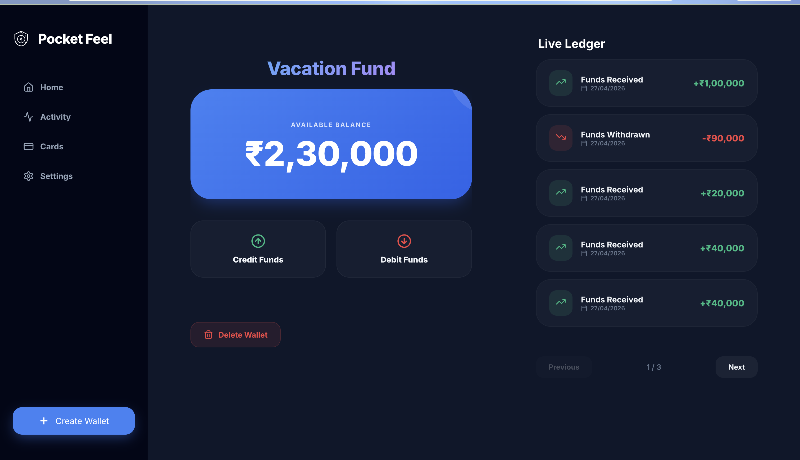

**Safe Swipe-to-Delete Confirmation**
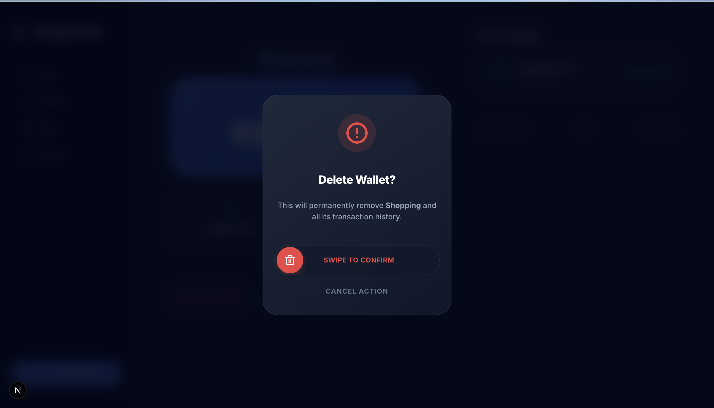

#### **4. Global Audit & Setup**
**Global Activity Ledger**
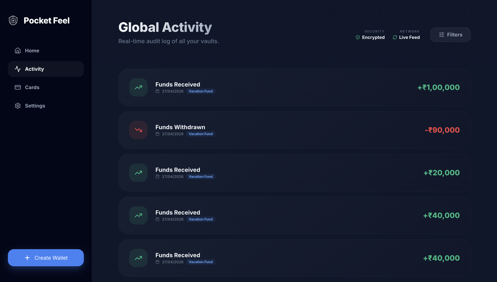

**Cards & Virtual Identity**
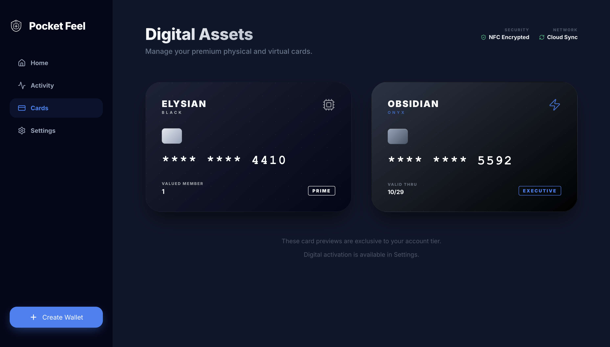

**Settings & Session Management**
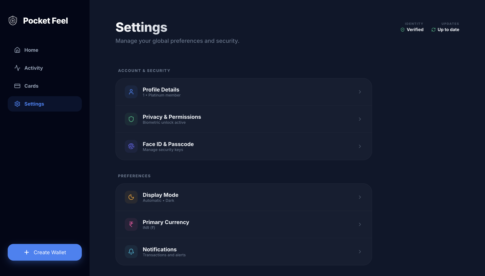

---

## 🏗️ Technical Architecture

### **Frontend (Next.js 15)**
- **State Management:** TanStack Query (React Query) for robust server-state caching.
- **Styling:** Styled Components + Framer Motion for premium animations.
- **Authentication Proxy:** Custom middleware handling route protection and session verification.

### **Backend (NestJS)**
- **Database:** Dual-support for PostgreSQL (Production) and SQLite (Local Dev).
- **ORM:** TypeORM with specialized transaction runners.
- **Validation:** Strict DTO-level integrity checking using `class-validator`.

---

## 🚦 Getting Started

### 1. Prerequisites
- **Node.js:** v18 or higher
- **Docker:** Recommended for local PostgreSQL orchestration

### 2. Environment Configuration

#### **Backend (`/backend/.env`)**
```env
PORT=3001
DB_TYPE=postgres
DB_HOST=localhost
DB_PORT=5432
DB_USERNAME=postgres
DB_PASSWORD=postgres
DB_NAME=hscore_wallet
```

#### **Frontend (`/frontend/.env.local`)**
```env
NEXT_PUBLIC_API_URL=http://localhost:3001/api/v1/wallet
```

### 3. Execution Commands
```bash
# 1. Start Database (PostgreSQL)
docker compose up -d

# 2. Launch Backend
cd backend && npm install && npm run start:dev

# 3. Launch Frontend
cd frontend && npm install && npm run dev
```
*Quick Toggle: To run without Docker, use `DB_TYPE=sqlite npm run start:dev` in the backend folder.*

---

## 📘 Project Documentation

To assist with the review process, the following deep-dive docs are available:

- **[Detailed API Guide (API.md)](./docs/API.md)** — Full endpoint specifications and response schemas.
- **[Frontend Flow Explanation (FRONTEND_FLOW.md)](./docs/FRONTEND_FLOW.md)** — Detailed walkthrough of the user journey.
- **[Environment Setup Guide (ENV_SETUP.md)](./docs/ENV_SETUP.md)** — Step-by-step variable configuration.

---

*Developed by John Loui*
